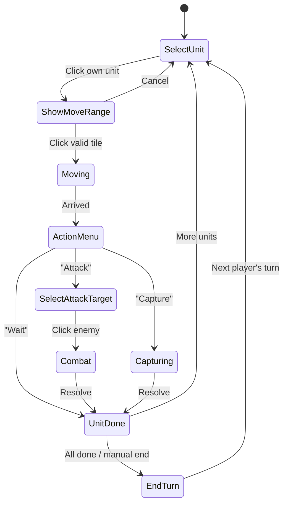

# Strategy Turn-Based Board Game — Implementation Plan

Build a browser-based strategy turn-based board game inspired by **Advance Wars / Fire Emblem**, using the existing Kenney 16×16 strategy tileset assets.

## Asset Inventory

The project already contains a complete **Kenney "Tiny Battle" tileset** (CC0 1.0 license):

| Category | Contents |
|----------|----------|
| **Terrain** | Grass (×3), Water (×23 edge variants), Road/Bridge tiles, Bush, Forest, Tree |
| **Buildings** | 10 building types × 5 team colors (blue, red, green, orange, gray) |
| **Units** | 13 unit types × 5 team colors (infantry, vehicles, aircraft, naval) |
| **Arrows** | 10 movement/path arrow tiles |
| **Overlay** | [blocked.png](file:///d:/OPSWAT/Sandbox/web-game/public/assets/Tiles/Overlay/blocked.png), [selected.png](file:///d:/OPSWAT/Sandbox/web-game/public/assets/Tiles/Overlay/selected.png) |
| **Emotes/UI** | Cursor, HP, Ammo, Fuel, Flag, Fog, Lock, Numbers 0-9, Unknown |
| **Tilemap** | Packed spritesheet (16×16, 1px spacing, 18×11 grid = 198 tiles) |
| **Tiled** | Sample [.tmx](file:///d:/OPSWAT/Sandbox/web-game/public/assets/Tiled/sampleMap.tmx) map (30×17, 5 layers: Terrain, Objects, Vehicles, UI, Shadows) |

---

## Tech Stack

| Layer | Choice | Rationale |
|-------|--------|-----------|
| **Build Tool** | **Vite** | Fast HMR, native TypeScript/ESM support, zero-config |
| **Language** | **TypeScript** | Type safety for complex game state, interfaces for ECS |
| **Rendering** | **PixiJS v8** | Hardware-accelerated WebGL/WebGPU renderer with excellent sprite batching, built-in spritesheet support, and a mature ecosystem |
| **Game Framework** | **Custom on top of PixiJS** | PixiJS handles rendering/input; we build game logic (turns, combat, AI) ourselves |
| **State Management** | **Custom EventBus** | Events for UI reactivity and game state changes |
| **Map Format** | **Tiled JSON** | Export [.tmx](file:///d:/OPSWAT/Sandbox/web-game/public/assets/Tiled/sampleMap.tmx) → `.json`; parse layers at runtime |
| **Audio** | **Howler.js** (future) | Simple audio API; add later |
| **Networking** | **Socket.io** (future) | Future online multiplayer support |
| **Testing** | **Vitest** | Native Vite integration, fast unit tests |

> [!NOTE]
> **PixiJS** handles rendering, sprite management, and input events. We build the game-specific logic (turn system, combat, AI, pathfinding) as a custom layer on top. This gives us the best of both worlds: performant rendering + full game logic control.

---

## Project Structure

```
web-game/
├── public/
│   ├── assets/                    # (existing) Kenney tileset
│   │   ├── Tiles/{Map,Buildings,Units,Arrows,Overlay,Emo}/
│   │   ├── Tilemap/tilemap_packed.png
│   │   └── Tiled/sampleMap.tmx
│   └── maps/                     # [NEW] Exported Tiled JSON maps
│       └── sample.json
├── src/
│   ├── main.ts                   # [NEW] Entry point — bootstrap PixiJS app
│   ├── core/                     # [NEW] Engine fundamentals
│   │   ├── Game.ts               #   Game class (PixiJS Application wrapper, scene management)
│   │   ├── AssetLoader.ts        #   PixiJS Assets spritesheet & map loader
│   │   ├── InputManager.ts       #   Mouse/touch/keyboard input (via PixiJS events)
│   │   ├── Camera.ts             #   Viewport panning & zoom (PixiJS Container transform)
│   │   ├── EventBus.ts           #   Pub/sub event system
│   │   └── constants.ts          #   TILE_SIZE, colors, enums
│   ├── map/                      # [NEW] Tilemap subsystem
│   │   ├── TileMap.ts            #   Grid data + terrain lookup
│   │   ├── TileMapRenderer.ts    #   PixiJS Container with Sprite grid rendering
│   │   ├── Pathfinder.ts         #   A* / BFS for movement range
│   │   └── TerrainData.ts        #   Terrain types, defense, movement cost
│   ├── entities/                 # [NEW] Game objects
│   │   ├── Unit.ts               #   Unit class (hp, ammo, fuel, movement)
│   │   ├── Building.ts           #   Building class (capture, production)
│   │   ├── UnitFactory.ts        #   Create units from type + team
│   │   └── BuildingFactory.ts    #   Create buildings from type + team
│   ├── data/                     # [NEW] Static game data (JSON/TS)
│   │   ├── units.ts              #   Unit stats (cost, move, range, damage)
│   │   ├── buildings.ts          #   Building types & properties
│   │   ├── terrains.ts           #   Terrain types & movement costs
│   │   └── damageMatrix.ts       #   Unit vs Unit damage lookup table
│   ├── systems/                  # [NEW] Game logic systems
│   │   ├── TurnManager.ts        #   Turn phases, player switching
│   │   ├── MovementSystem.ts     #   Move validation, path animation
│   │   ├── CombatSystem.ts       #   Damage calculation, counter-attacks
│   │   ├── CaptureSystem.ts      #   Building capture logic
│   │   ├── ProductionSystem.ts   #   Unit production from factories
│   │   ├── FogOfWarSystem.ts     #   Vision range, hidden tiles
│   │   └── VictorySystem.ts      #   Win/loss condition checks
│   ├── ai/                       # [NEW] AI opponent
│   │   ├── AIController.ts       #   AI decision loop
│   │   └── Evaluator.ts          #   Board state evaluation heuristics
│   ├── scenes/                   # [NEW] Game screens
│   │   ├── TitleScene.ts         #   Main menu
│   │   ├── BattleScene.ts        #   Core gameplay scene
│   │   └── VictoryScene.ts       #   End-of-game screen
│   ├── ui/                       # [NEW] In-game UI (PixiJS Text/Graphics + HTML overlay)
│   │   ├── HUD.ts                #   Turn indicator, funds, unit info
│   │   ├── ActionMenu.ts         #   Context menu (Move, Attack, Wait, Capture)
│   │   ├── UnitInfoPanel.ts      #   Selected unit stats panel
│   │   └── TerrainInfoPanel.ts   #   Hovered terrain info
│   └── utils/                    # [NEW] Helpers
│       ├── math.ts               #   Grid ↔ screen coordinate math
│       └── sprite.ts             #   Sprite slicing utilities
├── index.html                    # [NEW] Minimal HTML shell
├── package.json                  # [NEW] Vite + TS deps
├── tsconfig.json                 # [NEW] TypeScript config
└── vite.config.ts                # [NEW] Vite config
```

---

## Architecture Overview

```mermaid
graph TD
    subgraph Core
        GL["Game Loop (requestAnimationFrame)"]
        IM[InputManager]
        CAM[Camera]
        EB[EventBus]
        AL[AssetLoader]
    end

    subgraph Scenes
        TS[TitleScene]
        BS[BattleScene]
        VS[VictoryScene]
    end

    subgraph GameState["Game State (BattleScene)"]
        TM[TileMap]
        Units[Unit[]]
        Bldgs[Building[]]
        Turn[TurnManager]
    end

    subgraph Systems
        MS[MovementSystem]
        CS[CombatSystem]
        Cap[CaptureSystem]
        PS[ProductionSystem]
        FOW[FogOfWarSystem]
        AI[AIController]
    end

    subgraph Rendering
        TMR[TileMapRenderer]
        HUD[HUD]
        AM[ActionMenu]
    end

    GL --> BS
    BS --> GameState
    BS --> Systems
    BS --> Rendering
    IM --> BS
    CAM --> TMR
    EB --> HUD
    AL --> TMR
```

### Game Loop (Turn-Based)

Unlike real-time games, the loop only needs to:
1. **Process input** → cursor movement, tile clicks
2. **Update state** → execute current phase logic
3. **Render** → redraw map, units, UI overlays

The turn-based state machine:



---

## Phased Implementation Roadmap

### Phase 1 — Foundation (MVP: Render map + move units)
1. Scaffold Vite + TypeScript project
2. Load tilemap spritesheet, parse sample Tiled JSON
3. Render terrain layer to canvas with camera panning
4. Place units from map data, render with team colors
5. Click-to-select unit, show BFS movement range overlay
6. Click-to-move unit with path animation
7. Basic turn switching (Player 1 → Player 2)

### Phase 2 — Core Combat
1. Implement damage matrix & combat resolution
2. Attack action: select target in range, animate, resolve
3. Counter-attack mechanics
4. Unit HP display (number overlay from Emo tiles)
5. Unit death & removal

### Phase 3 — Buildings & Economy
1. Building capture system (infantry on enemy/neutral building)
2. HQ capture = victory condition
3. Factory production (spend funds to deploy units)
4. Income per turn from captured properties

### Phase 4 — UI & Polish
1. HUD (current player, funds, day counter)
2. Action menu (Move, Attack, Capture, Wait)
3. Unit info panel, terrain info panel
4. Smooth camera panning & cursor animation
5. Title screen & victory screen

### Phase 5 — AI & Advanced
1. Simple AI opponent (greedy: attack if possible, advance, capture)
2. Fog of War system
3. Additional maps
4. Sound effects (Howler.js)

---

## Confirmed Design Decisions

| # | Decision | Resolution |
|---|----------|------------|
| 1 | **Rendering** | PixiJS v8 — hardware-accelerated, excellent sprite support |
| 2 | **Spritesheet** | Use packed spritesheet ([tilemap_packed.png](file:///d:/OPSWAT/Sandbox/web-game/public/assets/Tilemap/tilemap_packed.png)) for efficiency |
| 3 | **Map format** | Convert [.tmx](file:///d:/OPSWAT/Sandbox/web-game/public/assets/Tiled/sampleMap.tmx) → JSON for runtime loading |
| 4 | **Multiplayer** | Local hot-seat + AI now; **online multiplayer planned for future** (Socket.io) |
| 5 | **Implementation approach** | Phase-by-phase, **guided/mentoring style** — I provide architecture & guidance, you implement |

---

## Verification Plan

### Automated Tests (Vitest)
```bash
npx vitest run
```
- **Pathfinder tests** — BFS range calculation, obstacle avoidance, movement costs
- **Combat tests** — Damage formula, counter-attacks, unit death
- **TurnManager tests** — Phase transitions, player switching
- **CaptureSystem tests** — Capture points accumulation, ownership transfer

### Browser Manual Verification
1. **Map rendering** — Open `http://localhost:5173`, verify the sample map renders correctly with grass, water, roads, trees, buildings
2. **Unit display** — Units appear with correct team colors at their map positions
3. **Camera panning** — Click-drag or arrow keys to scroll the map
4. **Unit selection** — Click a friendly unit → movement range overlay appears
5. **Unit movement** — Click a highlighted tile → unit moves along path
6. **Combat** — Move adjacent to enemy → Attack option → damage resolved, HP updated
7. **Turn flow** — End turn → other player can now act → back and forth
